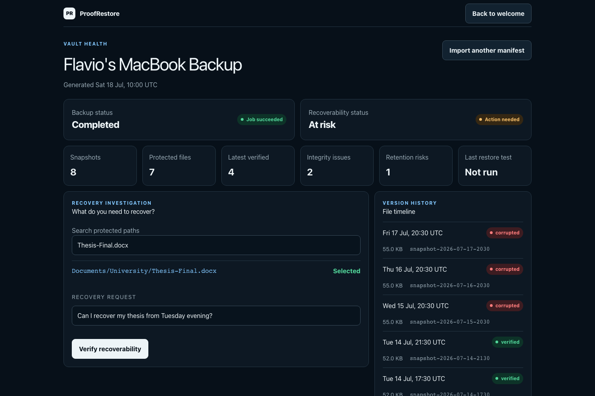
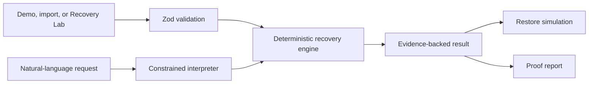

# ProofRestore

**Know your backup will restore before you need it.**

ProofRestore verifies whether a backup can actually be recovered before disaster strikes. It analyzes snapshot history, validates referenced objects, checks hashes and sizes, simulates restore actions without touching real files, surfaces retention risk, and downloads an evidence-backed **Proof of Recoverability** report.

**Live demo:** [proofrestore.vercel.app](https://proofrestore.vercel.app)

**Source:** [github.com/ATAC-Helicopter/ProofRestore](https://github.com/ATAC-Helicopter/ProofRestore)

The product is built around one distinction:

> Backup success is not recovery success.



The built-in synthetic vault demonstrates that distinction directly: the latest backup job reports success, while deterministic verification finds a corrupted thesis version, a missing presentation object, and a healthy financial document whose only copy is nearing expiry.

## Demo flow

The complete demo works without an OpenAI API key.

1. Open ProofRestore and click **Explore demo vault**.
2. Confirm the health contrast: **Latest backup job — Completed** and **Verified recoverability — At risk**, then click **Check a file**.
3. Search for `Thesis-Final.docx`, select `Documents/University/Thesis-Final.docx`, and choose **Original location** to expose conflicts.
4. Keep the request **Can I recover my thesis from Tuesday evening?** and click **Verify recoverability**.
5. ProofRestore selects the latest eligible snapshot at or before Tuesday 19:00 UTC: `snapshot-2026-07-14-1730`.
6. Inspect the **Fully recoverable** verdict and verified object, hash, and size evidence.
7. Click **Run restore simulation**. The original-location plan surfaces the newer destination copy as a conflict without changing it.
8. Open **exact evidence**, continue to the proof report, then click **Generate and download Markdown report**.

See [docs/demo-script.md](docs/demo-script.md) for the timed narration and fallback path.

## Recovery Lab for hands-on testing

You do not need to rely on the prepared demo. From the welcome screen, **Open recovery lab** creates a temporary, visible test environment in the current browser tab:

1. Choose files, choose a folder, or load the small built-in sample.
2. ProofRestore hashes every file locally and captures a baseline snapshot.
3. Add clean snapshots, simulate a modified file, or simulate a deletion while preserving history.
4. Inject byte-level corruption, remove a stored object behind a successful snapshot, or create a destination conflict.
5. Select the exact snapshot and file, run the same deterministic recovery engine, and inspect the verdict, totals, evidence codes, and ordered activity log.
6. Export the generated schema-valid manifest or open it in the complete investigation, simulation, evidence, and report workflow.

The lab never modifies the chosen files. Bytes are read and hashed in the browser, while snapshots, modified bytes, deletions, stored objects, and destination state exist only in memory and disappear on refresh. Uploaded file names are not sent to the interpreter. Because the baseline and observed hash originate in the same controlled browser simulation, the lab demonstrates ProofRestore's verification logic; it is not independent proof of a real backup provider.

## Architecture

ProofRestore is a stateless Next.js application with five deliberately separate layers:

- `app/manifest/` validates versioned JSON manifests with Zod, normalizes safe paths, rejects traversal, and applies size and collection limits.
- `app/recovery/` is the trusted core. Pure TypeScript logic selects snapshots, resolves paths, verifies integrity, determines restore actions, calculates totals, analyzes retention, and emits stable evidence.
- `app/lab/` builds bounded, schema-valid manifests from browser-selected files and applies explicit in-memory snapshot and failure operations. Raw bytes never enter an exported manifest.
- `app/interpret/` and `app/api/interpret/` interpret recovery language into constrained structured data. They never decide existence, integrity, safety, or the final verdict.
- `app/components/` presents the vault, timeline, recovery result, dry run, evidence, and report download. `app/reports/` renders the deterministic Markdown report.



More detail is available in [docs/architecture.md](docs/architecture.md), including the request sequence and security boundary.

## Deterministic trust boundary

Natural-language interpretation may identify an intent, candidate path, requested time, recursion preference, and destination mode. It may preserve ambiguity or request clarification.

Only deterministic code may decide:

- which snapshot is eligible;
- whether a path and object exist;
- whether availability, hashes, and sizes pass;
- whether an item is recoverable;
- whether a destination action is create, overwrite, skip, conflict, or unavailable;
- byte totals, retention risk, request verdicts, and evidence references.

The engine is read-only. It has no filesystem restore, overwrite, deletion, execution, provider connection, or destructive endpoint.

## OpenAI usage

The product UI sends recovery language through `POST /api/interpret`. By default the route uses the complete deterministic fallback. When both `OPENAI_API_KEY` is configured and `ENABLE_OPENAI_INTERPRETER=true`, it uses the OpenAI Responses API with a strict JSON schema. The route sends only the user query, a bounded list of valid path candidates, and a reference timestamp. It does not send the full manifest or object metadata, and it rejects a model-selected path outside the supplied candidates.

If model use is disabled, the key is missing, the request times out, or model output is malformed, the route returns the deterministic fallback interpreter. The main demo is intentionally independent of model availability. Public deployments should leave model use disabled unless they also add appropriate rate limits and spend controls.

## Local setup

Requirements:

- Node.js 24.x
- npm

```bash
npm ci
cp .env.example .env.local
npm run dev
```

Open [http://localhost:3000](http://localhost:3000).

Environment variables are optional:

```bash
# Enables the server-side structured interpreter.
OPENAI_API_KEY=

# Explicit opt-in. Leave false for public no-key demos.
ENABLE_OPENAI_INTERPRETER=false

# Optional override; defaults to gpt-5-mini.
OPENAI_MODEL=gpt-5-mini

# Optional canonical deployment URL for social metadata.
NEXT_PUBLIC_SITE_URL=
```

Never expose `OPENAI_API_KEY` through a `NEXT_PUBLIC_` variable. The complete built-in flow runs with the key unset and model interpretation disabled.

## Validation

```bash
npm run format:check
npm run lint
npm run typecheck
npm test
npm run build
```

The final repository passes formatting, lint, strict type checking, all 66 Vitest unit/integration tests, and the production build on Next.js 15.5.20. The same checks run in [GitHub Actions](.github/workflows/ci.yml).

The critical browser test requires a production build and Playwright Chromium:

```bash
npx playwright install chromium
npm run build
npm run test:e2e
```

The Chromium E2E suite passes 8/8. It covers the demo vault through thesis selection, Tuesday recovery, restore simulation, evidence expansion, and report download; valid and malformed manifest imports; the no-key API fallback; responsive clipping checks; partial-folder failure presentation; stale-result invalidation; and desktop and mobile Recovery Lab flows, including a real hash mismatch and interpreter isolation.

## Submission media

The checked-in scripts reproduce the cover, eight gallery states, and the paced pointer-enabled visual recording:

```bash
npm run build
npm run capture:submission
npm run record:demo
```

- [3:2 project cover](docs/assets/submission/cover-1500x1000.png)
- [Welcome](docs/assets/submission/00-welcome-1600x900.png)
- [Vault health](docs/assets/submission/01-vault-health-1600x900.png)
- [Recovery request](docs/assets/submission/02-recovery-request-1600x900.png)
- [Verified result](docs/assets/submission/03-verified-result-1600x900.png)
- [Restore simulation and evidence](docs/assets/submission/04-simulation-evidence-1600x900.png)
- [Proof report](docs/assets/submission/05-proof-report-1600x900.png)
- [Recovery Lab setup and local-only safety boundary](docs/assets/submission/06-recovery-lab-setup-1600x900.png)
- [Recovery Lab with injected corruption and evidence](docs/assets/submission/07-recovery-lab-result-1600x900.png)
- [Final narrated demo with selectable captions and visible pointer](docs/assets/submission/proofrestore-demo-final.mp4)

The repository retains only the publication MP4, [SRT captions](docs/assets/submission/proofrestore-demo-captions.srt), and [narration source](docs/demo-narration.txt)—not large intermediate audio or silent-video renders. The final 1:55 cut is 1600×900 H.264 with normalized 48 kHz stereo AAC audio, smooth recorder-controlled scrolling, human-like pointer movement and click pulses, and a default English caption track that viewers can enable or disable. It covers both the mandatory thesis recovery and the hands-on Recovery Lab. The narration uses Microsoft Edge's `en-US-AndrewMultilingualNeural` voice and is disclosed in the first caption. Upload the SRT separately because video hosts may discard embedded subtitles during transcoding. Publishing checks are in [docs/media-production.md](docs/media-production.md).

## Manifest import

The import surface accepts a version `1.0` JSON manifest. Imported data is parsed as data only, rendered as React text, and never executed. Validation rejects malformed timestamps, duplicate IDs or paths, unsafe traversal, invalid entry shapes, unknown expiry references, and inputs beyond configured limits.

The full contract is defined in `app/types/manifest.ts` and `app/manifest/schema.ts`. The built-in readable example is `app/demo/vault.ts`.

## Deployment

ProofRestore is stateless and Vercel-compatible.

1. Push the repository to a Git provider and import it into Vercel.
2. Keep the standard Next.js build command, `npm run build`.
3. For the safest public demo, leave model use disabled. A credentialed deployment requires `OPENAI_API_KEY`, `ENABLE_OPENAI_INTERPRETER=true`, and appropriate rate-limit/spend protection.
4. Deploy, then exercise the no-key demo flow and, if configured, the interpreter endpoint.

For another Node host, run `npm install`, `npm run build`, and `npm run start`. No database, migrations, storage bucket, or background service is required.

## Known limitations

- ProofRestore reads versioned ProofRestore manifests; it does not connect to backup providers or arbitrary backup formats.
- Restore operations are simulations only. No file is ever restored or modified.
- The Recovery Lab is intentionally ephemeral and same-origin: it validates the product logic in a controlled browser simulation, not the authenticity of a real provider backup. Browser folder selection does not preserve empty folders.
- There is no authentication, persistence, scheduling, multi-user workflow, or signed report.
- Retention findings use the expiry data represented in the manifest; they do not change provider policies.
- The OpenAI route is constrained to interpretation. Model use is explicitly opt-in, while the default UI path uses the same endpoint's deterministic fallback so the demo cannot depend on credentials or network access.
- Markdown is the downloadable report format; HTML/PDF export is not included in the MVP.
- The synthetic demo timestamps are fixed in UTC for reproducible results.
- A root override pins patched PostCSS `8.5.19` while the selected Next.js release still requests an older transitive version; keep the override until Next.js updates its own dependency and continue reviewing automated security alerts.

## Hackathon development note

ProofRestore was built as a focused OpenAI hackathon sprint in Codex. The lead agent established the architecture, integrated the product, and ran final validation. Independent subagents worked with non-overlapping ownership on the manifest schema and architecture, recovery engine and adversarial tests, deterministic demo dataset, UI and interpreter integration, and submission documentation. All recoverability claims remain backed by executable deterministic logic and tests rather than agent or model judgment.

## License and security

ProofRestore is available under the [MIT License](LICENSE). Please report vulnerabilities privately through GitHub as described in [SECURITY.md](SECURITY.md); do not attach real backup data, private paths, or credentials to public issues.

**Backups should not require faith.**
