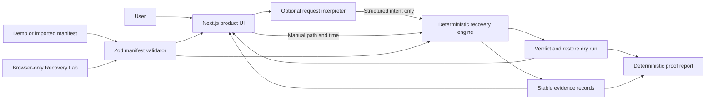
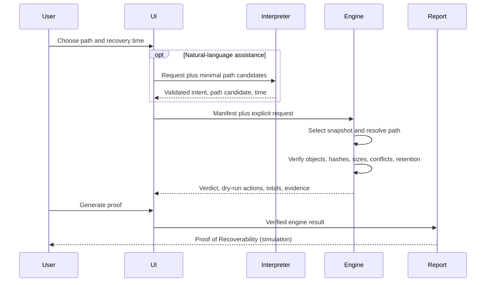

# ProofRestore architecture

## Design objective

ProofRestore answers a narrow question: can a selected backup version be recovered? It separates convenient language interpretation from trusted recovery decisions. The application is a stateless Next.js deployment with no database and no code path that writes restored files.

## System map

## Trust boundary

The optional OpenAI layer may identify intent, map a phrase to one of the path candidates supplied by the application, interpret a date phrase, preserve ambiguity, and summarize results already produced by trusted code. Its output is validated structured data and is treated as an untrusted suggestion.

Only deterministic TypeScript code may select a snapshot, resolve a path, establish object availability, compare hashes or sizes, choose restore actions, calculate byte totals, evaluate retention, assign item or request verdicts, and emit evidence references. The UI and report render those results; they do not infer a better verdict. If model access is unavailable or fails, the same engine is driven by manual controls and a narrow local fallback.

## Components

| Area                | Responsibility                                       | Safety property                                 |
| ------------------- | ---------------------------------------------------- | ----------------------------------------------- |
| `app/manifest`      | Parse, normalize, bound, and validate manifest input | Strict versioned schema; no filesystem access   |
| `app/demo`          | Provide fixed synthetic backup history               | Reproducible UTC timestamps and scenarios       |
| `app/lab`           | Build controlled manifests and inject test failures  | Browser memory only; raw bytes are not exported |
| `app/recovery`      | Select, verify, plan, total, and explain             | Pure computations; never performs a restore     |
| `app/api/interpret` | Convert natural language to constrained intent       | Never returns a recovery verdict                |
| `app/reports`       | Render verified results into exportable proof        | Deterministic template with escaped input       |
| `app/components`    | Present investigation, evidence, and simulation      | Status claims originate in engine results       |

## Manifest boundary

Manifest schema `1.0` is the only accepted version. Validation is strict: unknown object keys, unsafe paths, invalid dates, duplicate identifiers, duplicate normalized paths, impossible snapshot chronology, and dangling retention-expiry references are rejected. Timestamps with explicit offsets are accepted and normalized to UTC ISO 8601.

Paths are data, never local filesystem targets. They are case-sensitive and normalized to relative POSIX separators. Absolute paths, Windows drive paths, UNC roots, control characters, `.` segments, and `..` traversal are rejected before recovery analysis. A file may reference an object absent from the object collection by design: this represents a real missing-object failure that the deterministic engine must surface rather than an invalid manifest shape.

JSON upload text is byte-limited before parsing. The default helper limit is 5 MiB; the browser import surface should enforce the same limit before retaining the payload. Array limits provide a second bound against pathological valid JSON.

## Recovery Lab boundary

The Recovery Lab accepts up to 50 browser-selected files, 20 MiB per file and 50 MiB total. It reads bytes through the browser file picker, hashes them with Web Crypto SHA-256, synthesizes parent-directory records, and captures a schema-valid baseline snapshot. Explicit controls can capture another clean snapshot, append a byte to a virtual working copy, remove a virtual working file from a later snapshot, flip a stored byte, remove a referenced object, or add a conflicting destination entry.

Every operation is recorded in an ordered on-screen activity log. The selected originals are never written, overwritten, deleted, or uploaded; raw bytes remain in browser memory and are stripped when the manifest is validated or exported. Lab investigations bypass the natural-language endpoint entirely, so selected names do not leave the tab. Refreshing or resetting clears the session.

This boundary is intentionally honest: both the expected baseline hash and observed object hash initially originate in the same browser session. The lab proves that the deterministic engine detects controlled integrity and availability failures; it does not independently attest that a real backup provider stored the original bytes correctly.

## Recovery sequence

## Evidence and reproducibility

Every material decision carries a stable evidence code and entity references. Reports include the chosen snapshot, request, totals, item outcomes, conflicts, integrity and retention findings, restore plan, and evidence appendix. Demo and test clocks are fixed, so snapshot selection and urgency do not vary by locale or execution date.

## Runtime and deployment

The UI and deterministic core run without an API key. Model use requires both a server-only `OPENAI_API_KEY` and `ENABLE_OPENAI_INTERPRETER=true`; otherwise the same endpoint returns deterministic interpretation. Full manifests and object metadata are not sent to the model, request bodies are limited to 64 KiB, and model-selected paths must match supplied candidates. The project has no authentication, persistence, background worker, provider connection, or destructive restore endpoint. It is suitable for a stateless Vercel deployment; a public credentialed deployment should add rate limits and spend controls.

## Deliberate limitations

- Imported manifests must use ProofRestore schema `1.0`; there are no provider adapters in the MVP.
- Hashes and object observations are asserted by the supplied manifest. ProofRestore does not contact storage providers.
- The restore plan is a simulation and cannot create, overwrite, or delete files.
- Case-sensitive matching is consistent across platforms but may differ from a source filesystem.
- Retention results describe the explicit or derived policy data present in the manifest, not a live provider policy.
- The MVP does not include authentication or rate limiting, so public deployments should leave credentialed model interpretation disabled unless external controls are added.
